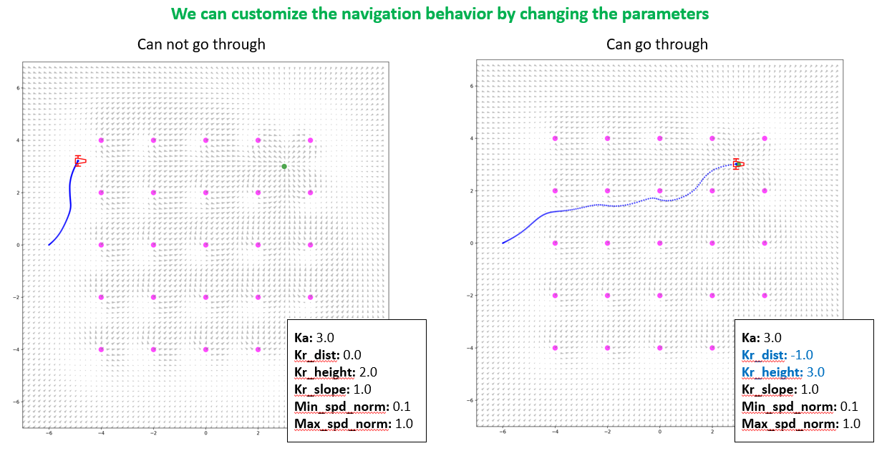

# ros2-vector-field-controller

This ROS2 package, vector field based, allows your robot to follow an attractive point while avoiding collision with repulsive points from a Laser-Scan. A speed command can also be send to override the point following. Allowing for an assissted teleoperation with collision avoidance.

<div style="text-align: center;">
|
</div>
<table align="center">
  <tr>
    <td align="center">
      <a href="materials/doc.pdf">Check the Documentation</a>
    </td>
  </tr>
  <tr>
    <td align="center">
      <a href="materials/">More materials</a>
    </td>
  </tr>
</table>

https://github.com/Noceo200/ros2-vector-field-controller.git

## Dependencies
* ROS2 (Tested on Humble): https://docs.ros.org/en/humble/Installation/Ubuntu-Install-Debs.html

The following ROS2 packages are used and should be available once ROS2 is installed:
* ament_cmake
* rclcpp
* sensor_msgs
* tf2
* tf2_ros
* tf2_geometry_msgs
* rosgraph_msgs
* nav_msgs
* PCL
* pcl_conversions
* visualization_msgs

If needed, install the missing ones:
```
sudo apt-get install ros-<ros_version>-<PACKAGE_name>
```

## Installation

```
cd <your_ros2_workspace>/src/
git clone https://github.com/Noceo200/ros2-vector-field-controller.git
cd ..
colcon build
```

 ## API

### Subscribed topics
 | Topic  | Type | Description |
 |-----|----|----|
 | /scan  | `sensor_msgs/LaserScan` | The laser scan that will be used to consider repulsive points |
 | /attr_point  | `geometry_msgs/PointStamped` | The attractive point |
 | /cmd_vel_assissted_teleop  | `geometry_msgs/Twist` | Other speed command to apply, prioritized to the point following |
 | /vector_field_controller_alive  | `std_msgs/Bool` | Topic to keep the controller running or to stop it |
  | /clock  | `rosgraph_msgs/Clock` | Topic to use a simulation time, if there is one |
 | **tf** | N/A | A valid transform from your configured frames |

### Published topics
 | Topic  | Type | Description |
 |-----|----|----|
 | /cmd_vel  | `geometry_msgs/Twist` | The final speed commands |
 | /cmd_vel_vector  | `geometry_msgs/TwistStamped` | A twistStamped message visualizable on RVIZ to check the commands sent |
 | /vector_field  | `visualization_msgs/MarkerArray` | The vector field (marker array) |

## Configuration

### Node Settings

`rate` - The frequency at which the node operates, in Hz.

`input_repulsive_scan_topic` - The laser scan topic that will be used to consider repulsive points.

`input_attractive_point_topic` - The attractive point topic.

`input_cmd_topic` - Other speed command topic to apply, priority over the point following.

`output_cmd_topic` - The topic on which to publish the final speed commands.

`output_command_feedback_topic` - The topic on which to publish a twistStamped message visualizable on RVIZ.

`input_keep_alive_topic` - The topic to keep the controller running or to stop it (only for the point following).

`keep_alive_timeout` - If nothing is received on 'keep_alive_topic' then this delay defines how much time to wait before stopping the controller. (only for point following), this timeout value is also used for pausing the computation when nothing is received on 'input_cmd_topic'.

### Vector Field Configuration

`robot_frame` - The frame attached to the robot.

`map_frame` - The global frame.

`control_type` - The controller type 'diff' (differential) or 'omni' (omnidirectional) (Only 'omni' available for now).

`max_spd_norm` - Used for repulsive, attractive and final commands clamping, the output command will not have a norm higher than this value.

`zero_padding_radius` - Define minimal norm of speeds commands to be received on 'input_cmd_topic' before to apply it. (allows to avoid sending too small values as command to the hardware).

### Linear Attractivity

`min_spd_norm` - Used only to clamp minimal attractive command.

`min_goal_dist` - Minimal distance between attractive point and current position (if point following running) to consider the robot successful and stop it.

`ka_force` - Proportionnal coefficient for attractivity.

### Exponential Repulsivity

`kr_dist` - Repulsivity coefficient, specify the radius around the point before the effect starts to exponentially disappear, can be negative.

`kr_height` - Linearly multiply the repulsive forces.

`kr_slope` - Modify the curve, how abrupt it is to lose effect.

### Visual Options

`publish_field` - A boolean flag to choose whether to publish the vector field or not (reduces the performances).

`output_field_topic` - The topic on which to publish the vector field (marker array).

`field_grid_reso_x` - How many points to show on the x-axis.

`field_grid_reso_y` - How many points to show on the y-axis.

`field_grid_x_elong` - Size of vector field to print on the x-axis, around robot's pose.

`field_grid_y_elong` - Size of vector field to print on the y-axis, around robot's pose.

`arrows_size_multiplier` - The size multiplier for arrows in the vector field.

### Debugging

`debug` - A boolean flag to enable or disable debugging.

`debug_file_path` - The file path where debug information will be saved.

## Launch the python simulation (Usually used for fast testing of vector fields)
Specify your parameters directly into the python file.
```
python3 phyton_visualizer/ros2_vector_field_controller_simulation.py
```

## Launch ROS2 Node
Two parameters can be specified when launching the package.

`use_sim_time` - If True, the package will subscribed to `/clock` and use this time to publish its messages. Otherwise, the system's clock will be used.

`params_file` - YAML file tu consider for the configurations.

To launch with the default configurations in "config/vector_field_controller_config.yaml":
```
ros2 launch ros2_vector_field_controller vector_field_controller.launch.py use_sim_time:=<true/false>
```

To launch with your own configurations:
```
ros2 launch ros2_vector_field_controller vector_field_controller.launch.py params_file:=<your_yaml_file_path> use_sim_time:=<true/false>
```
